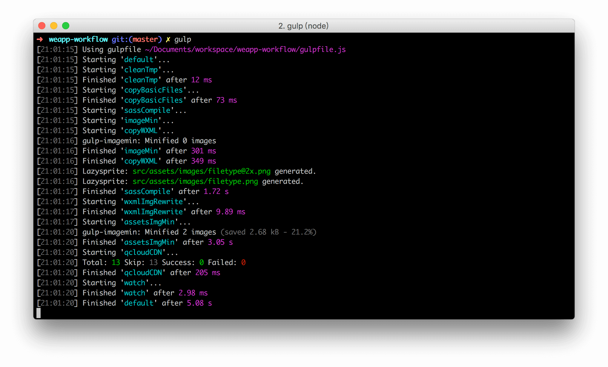

## 开始使用

> Node 版本建议在v4 以上。因为该工作流涉及到第三方依赖，建议在科学上网的环境下操作。

### 安装

0、请先全局按照 Gulp-cli

```
npm install gulp-cli -g
```

1、通过`git clone`下载项目文件。

```
git clone https://github.com/Jeff2Ma/WeApp-Workflow
```
2、建议删除`.git`目录（Windows 用户请手动删除）

```
cd WeApp-Workflow
rm -rf .git
```

3、安装必要模块

```
npm i
```

4、启动开发

建议复制`config.js`并重命名为`config.custom.js`，然后根据个人实际需求改写相关配置信息（每个配置项均有注释说明）。接下来在终端中运行如下命令开启：

```
gulp
```



其余任务：`gulp clean`：清除`dist`，`tmp`文件夹。


